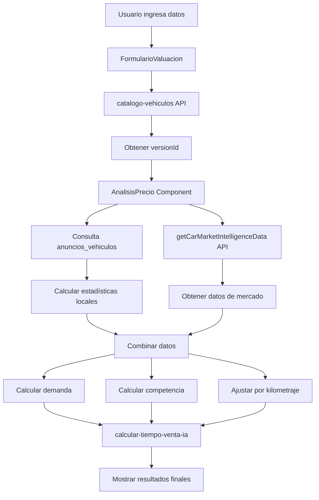

# Reporte Técnico: Sistema de Valuación de Vehículos

## Resumen Ejecutivo

El sistema de valuación de vehículos es una aplicación web compleja que combina múltiples fuentes de datos, APIs externas, inteligencia artificial y algoritmos de cálculo para proporcionar una estimación precisa del valor de mercado de un vehículo. Este reporte detalla el flujo completo de datos, las transformaciones aplicadas y los cálculos realizados.

## Arquitectura General del Sistema

### Componentes Principales

1. **ValuacionAuto.tsx** - Componente contenedor principal
2. **FormularioValuacion.tsx** - Captura de datos del vehículo
3. **AnalisisPrecio.tsx** - Motor de análisis y cálculos principales
4. **AnalisisMercado.tsx** - Visualización de datos de mercado
5. **Edge Functions** - Servicios backend para APIs externas
6. **Base de Datos Supabase** - Almacenamiento de datos históricos

## Flujo de Datos Detallado

### 1. Captura de Información del Vehículo

**Componente:** `FormularioValuacion.tsx`

#### Fuentes de Datos:
- **API Externa MaxiPublica**: Catálogo jerárquico de vehículos
  - Endpoint: `https://api.maxipublica.com/v3/catalog/mx/mxp/`
  - Estructura: Marca → Modelo → Año → Versión

#### Proceso de Obtención:
```typescript
// Secuencia de llamadas jerárquicas
1. cargarMarcas() → catalogo-vehiculos (catalogId: null)
2. cargarModelos(marcaId) → catalogo-vehiculos (catalogId: marcaId)
3. cargarAnos(modeloId) → catalogo-vehiculos (catalogId: modeloId)
4. cargarVersiones(anoId) → catalogo-vehiculos (catalogId: anoId)
```

#### Datos Capturados:
- `marca`: Nombre de la marca del vehículo
- `modelo`: Modelo específico
- `ano`: Año de fabricación
- `version`: Versión/trim específico
- `versionId`: ID único de la versión para APIs
- `kilometraje`: Valor por defecto 0
- `estado`: Valor por defecto "Nacional"
- `ciudad`: Valor por defecto "Nacional"

### 2. Obtención de Datos de Mercado

**Componente:** `AnalisisPrecio.tsx`

#### 2.1 Datos de Anuncios Similares

**Fuente:** Base de datos Supabase - Tabla `anuncios_vehiculos`

```sql
-- Query base aplicada
SELECT titulo, precio, kilometraje, ano, ubicacion, sitio_web, url_anuncio
FROM anuncios_vehiculos 
WHERE marca ILIKE '%{marca}%' 
  AND modelo ILIKE '%{modelo}%'
  AND ano BETWEEN {anoMinimo} AND {anoMaximo}
  AND activo = true
  AND precio > 0
```

#### Filtros Dinámicos Aplicados:
- **Por Estado/Ubicación:** `ubicacion ILIKE '%{estadoSeleccionado}%'`
- **Por Tipo de Vendedor:** Detectado mediante análisis del `sitio_web`
  - Profesional: kavak.com, seminuevos.com, etc.
  - Particular: mercadolibre.com.mx, facebook.com, etc.

#### 2.2 Inteligencia de Mercado Externa

**Edge Function:** `getCarMarketIntelligenceData`

**API Externa:** MaxiPublica Market Intelligence
- Endpoint: `https://api.maxipublica.com/v3/232AE09500000534D23EE1295785AA9834/example/{versionId}`
- Autenticación: Token Bearer almacenado en secrets de Supabase

**Datos Obtenidos:**
```typescript
interface MarketIntelligenceData {
  suggestedPrice: {
    suggestedPricePublish: number;    // Precio sugerido de publicación
    suggestedPriceSale: number;       // Precio sugerido de venta
    averagePriceSale: number;         // Precio promedio de venta
    purchasePrice: number;            // Precio de compra
    priceDown: number;                // Precio mínimo del rango
    priceUp: number;                  // Precio máximo del rango
  };
  averageSalesTime: {
    averageTime: number;              // Tiempo promedio de venta en días
  };
  normalDistribution: {
    Q1: number;                       // Primer cuartil
    Q2: number;                       // Mediana
    Q3: number;                       // Tercer cuartil
  };
  depreciationFactorByDay: number;    // Factor de depreciación diaria
  avgMillage: number;                 // Kilometraje promedio
}
```

### 3. Cálculos y Transformaciones de Datos

#### 3.1 Estadísticas Básicas de Precios

**Algoritmo de Cálculo:**
```typescript
const calcularEstadisticas = (autosSimilares: AutoSimilar[]) => {
  const precios = autosSimilares.map(auto => auto.precio).filter(p => p > 0);
  
  return {
    precioPromedio: precios.reduce((a, b) => a + b, 0) / precios.length,
    precioMinimo: Math.min(...precios),
    precioMaximo: Math.max(...precios),
    precioRecomendado: calcularPrecioRecomendado(precios),
    totalAnuncios: autosSimilares.length
  };
};
```

#### 3.2 Algoritmo de Precio Recomendado

**Metodología:** Combinación de datos locales y externos
```typescript
const calcularPrecioRecomendado = () => {
  if (precioPromedioMercado > 0) {
    // Priorizar datos de inteligencia de mercado (70%) + datos locales (30%)
    return (precioPromedioMercado * 0.7) + (precioPromedio * 0.3);
  } else {
    // Usar solo datos locales con ajustes estadísticos
    return aplicarAjusteEstadistico(precioPromedio, precios);
  }
};
```

#### 3.3 Cálculo de Demanda del Vehículo

**Algoritmo Multi-Factor (Puntaje 0-100):**

```typescript
const calcularDemandaAuto = () => {
  let puntajeDemanda = 0;
  
  // Factor 1: Antigüedad (35% del peso)
  const antiguedad = new Date().getFullYear() - datos.ano;
  if (antiguedad <= 2) puntajeDemanda += 35;      // Vehículos muy nuevos
  else if (antiguedad <= 5) puntajeDemanda += 28; // Vehículos nuevos
  else if (antiguedad <= 8) puntajeDemanda += 20; // Edad media
  else if (antiguedad <= 12) puntajeDemanda += 12; // Usados
  else puntajeDemanda += 5;                        // Antiguos
  
  // Factor 2: Análisis de oferta/competencia (30% del peso)
  const totalAnuncios = autosSimilares.length;
  if (totalAnuncios <= 3) puntajeDemanda += 30;      // Muy poca oferta
  else if (totalAnuncios <= 8) puntajeDemanda += 22; // Poca oferta
  else if (totalAnuncios <= 15) puntajeDemanda += 15; // Moderada
  else if (totalAnuncios <= 25) puntajeDemanda += 8;  // Mucha oferta
  else puntajeDemanda += 3;                           // Excesiva
  
  // Factor 3: Estabilidad de precios (20% del peso)
  const dispersionPrecios = Math.abs(precioMaximo - precioMinimo) / precioPromedio;
  if (dispersionPrecios < 0.3) puntajeDemanda += 20; // Precios estables
  else if (dispersionPrecios < 0.6) puntajeDemanda += 12; // Variación moderada
  else puntajeDemanda += 5; // Alta variación
  
  // Factor 4: Prestigio de marca (15% del peso)
  const marcasAlta = ['Toyota', 'Honda', 'Mazda', 'Subaru'];
  const marcasMedia = ['Nissan', 'Chevrolet', 'Ford', 'Volkswagen'];
  if (marcasAlta.includes(datos.marca)) puntajeDemanda += 15;
  else if (marcasMedia.includes(datos.marca)) puntajeDemanda += 10;
  else puntajeDemanda += 5;
  
  return clasificarDemanda(puntajeDemanda);
};
```

#### 3.4 Análisis de Competencia

**Algoritmo de Intensidad Competitiva:**
```typescript
const calcularCompetenciaMercado = () => {
  let factorCompetencia = autosSimilares.length;
  
  // Ajustes por filtros aplicados
  if (estadoSeleccionado === "todos") factorCompetencia *= 1.3;
  if (tipoVendedorSeleccionado === "todos") factorCompetencia *= 1.2;
  
  // Análisis de dispersión de precios
  const coeficienteVariacion = calcularCoeficienteVariacion(precios);
  let intensidadCompetencia = "normal";
  
  if (coeficienteVariacion > 0.4) intensidadCompetencia = "agresiva";
  else if (coeficienteVariacion < 0.15) intensidadCompetencia = "estable";
  
  return clasificarCompetencia(factorCompetencia, intensidadCompetencia);
};
```

#### 3.5 Ajuste por Kilometraje

**Algoritmo de Impacto en Precio:**
```typescript
const calcularFactorKilometraje = (kilometraje: number) => {
  const anoActual = new Date().getFullYear();
  const antiguedad = anoActual - datos.ano;
  const kmAnualEsperado = 15000; // Promedio mexicano
  const kmEsperadoTotal = antiguedad * kmAnualEsperado;
  
  const factorKmVsEsperado = kilometraje / kmEsperadoTotal;
  
  // Tabla de ajustes
  let factor = 1;
  if (factorKmVsEsperado <= 0.5) factor = 1.12;      // +12%
  else if (factorKmVsEsperado <= 0.7) factor = 1.08;  // +8%
  else if (factorKmVsEsperado <= 0.9) factor = 1.04;  // +4%
  else if (factorKmVsEsperado <= 1.1) factor = 1;     // Normal
  else if (factorKmVsEsperado <= 1.3) factor = 0.96;  // -4%
  else if (factorKmVsEsperado <= 1.5) factor = 0.92;  // -8%
  else factor = 0.85;                                  // -15%
  
  // Límites de seguridad
  return Math.max(0.75, Math.min(1.15, factor));
};
```

### 4. Estimación de Tiempo de Venta con IA

**Edge Function:** `calcular-tiempo-venta-ia`

#### Entrada de Datos:
```typescript
interface InputIA {
  precioSeleccionado: number;
  precioRecomendado: number;
  datosVehiculo: DatosVehiculo;
  estadisticasMercado: {
    demanda: string;
    competencia: string;
    tendencia: string;
  };
}
```

#### Procesamiento IA:
- **API:** OpenAI GPT para análisis contextual
- **Prompt Engineering:** Análisis de múltiples factores de mercado
- **Cache:** Sistema de caché para evitar llamadas repetidas

#### Salida Estructurada:
```typescript
interface ResultadoTiempoIA {
  tiempoEstimado: number;                    // Días estimados
  velocidadVenta: 'rapida' | 'moderada' | 'lenta';
  explicacion: string;                       // Justificación
  consejos: string[];                        // Recomendaciones
  factores: {
    precio: string;
    demanda: string;
    competencia: string;
    condicion: string;
  };
}
```

### 5. Visualización de Datos

#### 5.1 Distribución de Precios

**Algoritmo de Rangos:**
```typescript
const calcularDistribucionPrecios = () => {
  const precios = autosSimilares.map(auto => auto.precio);
  const precioMinimo = Math.min(...precios);
  const precioMaximo = Math.max(...precios);
  const rango = precioMaximo - precioMinimo;
  const numRangos = 5;
  const tamanoRango = rango / numRangos;
  
  return rangos.map((_, i) => ({
    inicio: precioMinimo + (i * tamanoRango),
    fin: precioMinimo + ((i + 1) * tamanoRango),
    cantidad: calcularAutosEnRango(i),
    porcentaje: (cantidad / autosSimilares.length) * 100
  }));
};
```

#### 5.2 Posicionamiento del Vehículo

**Cálculo de Percentiles:**
```typescript
const calcularPosicionMercado = () => {
  const posicionPrecio = ((precio - precioMinimo) / (precioMaximo - precioMinimo)) * 100;
  const posicionKilometraje = ((kilometraje - kmMinimo) / (kmMaximo - kmMinimo)) * 100;
  
  return {
    posicionPrecio,
    posicionKilometraje,
    percentilPrecio: calcularPercentil(precio, precios),
    percentilKilometraje: calcularPercentil(kilometraje, kilometrajes)
  };
};
```

### 6. Sistema de Filtros Dinámicos

#### Estados Disponibles:
- Extracción automática de ubicaciones únicas desde `anuncios_vehiculos`
- Normalización de nombres de estados
- Conteo dinámico de anuncios por estado

#### Tipos de Vendedor:
```typescript
const detectarTipoVendedor = (sitioWeb: string) => {
  const sitiosProfesionales = [
    'kavak.com', 'seminuevos.com', 'autocity.com',
    'carmatch.mx', 'autoplaza.com.mx'
  ];
  
  const sitiosParticulares = [
    'mercadolibre.com.mx', 'facebook.com', 
    'olx.com.mx', 'segundamano.mx'
  ];
  
  return sitiosProfesionales.some(s => sitioWeb.includes(s)) ? 'profesional' : 'particular';
};
```

### 7. Gestión de Cache y Performance

#### Cache de Resultados IA:
```typescript
const cache = new Map<string, ResultadoTiempoIA>();
const cacheKey = `${precioSeleccionado}-${precioRecomendado}-${marca}-${modelo}-${ano}`;
```

#### Debouncing de Cálculos:
```typescript
useEffect(() => {
  const timeoutId = setTimeout(() => {
    calcularTiempo(/* parámetros */);
  }, 500); // 500ms debounce
  
  return () => clearTimeout(timeoutId);
}, [precioSeleccionado]);
```

### 8. Manejo de Errores y Fallbacks

#### Estrategia de Fallback:
1. **API Externa No Disponible:** Usar solo datos locales de anuncios
2. **Sin Datos de Anuncios:** Generar datos sintéticos basados en parámetros del vehículo
3. **Error en IA:** Respuesta predeterminada con consejos genéricos
4. **Timeout de APIs:** Mensaje informativo y datos parciales

#### Ejemplo de Fallback:
```typescript
const fallbackData = {
  tiempoEstimado: 30,
  velocidadVenta: 'moderada',
  explicacion: 'Estimación aproximada (servicio no disponible)',
  consejos: [
    'Mantén un precio competitivo',
    'Conserva el vehículo en buenas condiciones',
    'El kilometraje es un factor importante'
  ]
};
```

## Flujo de Datos Completo



## Métricas de Performance

### Tiempos de Respuesta Esperados:
- **Carga de catálogo:** 200-500ms por nivel
- **Consulta de anuncios:** 300-800ms
- **API de inteligencia:** 500-1500ms
- **Cálculo de IA:** 1000-3000ms
- **Renderizado final:** 100-300ms

### Optimizaciones Implementadas:
- Memoización de cálculos complejos (`useMemo`)
- Cache de resultados de IA
- Debouncing de actualizaciones
- Consultas optimizadas con índices
- Fallbacks para APIs externas

## Consideraciones de Seguridad

### APIs Externas:
- Tokens almacenados en Supabase Secrets
- Validación de parámetros de entrada
- Rate limiting en Edge Functions
- Manejo seguro de errores sin exposición de datos internos

### Base de Datos:
- Row Level Security (RLS) activado
- Consultas parametrizadas
- Validación de tipos de datos
- Logs de auditoría para cambios importantes

## Conclusiones

El sistema de valuación implementa una arquitectura robusta que combina:

1. **Múltiples fuentes de datos** para mayor precisión
2. **Algoritmos adaptativos** que se ajustan a condiciones de mercado
3. **Inteligencia artificial** para análisis contextual
4. **Optimizaciones de performance** para una experiencia fluida
5. **Estrategias de fallback** para alta disponibilidad

La precisión del sistema depende de la calidad y cantidad de datos disponibles, aplicando técnicas estadísticas y de machine learning para proporcionar estimaciones confiables del valor de mercado de vehículos.