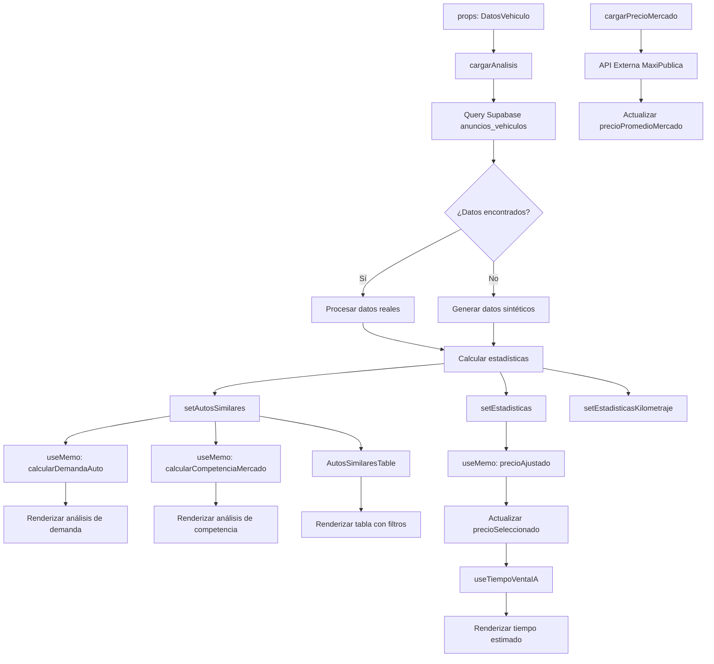

# Reporte Técnico: Componente AnalisisPrecio.tsx

## Resumen Ejecutivo

El componente `AnalisisPrecio.tsx` es el núcleo del sistema de análisis de precios de vehículos. Procesa múltiples fuentes de datos, aplica algoritmos complejos de cálculo y presenta información interactiva para la valuación inteligente de automóviles.

## 1. FUENTES DE DATOS

### 1.1 Datos Principales de Entrada

```typescript
interface DatosVehiculo {
  marca: string;          // Marca del vehículo (ej: "Toyota")
  modelo: string;         // Modelo específico (ej: "Corolla")
  ano: number;           // Año de fabricación
  version: string;       // Versión específica
  versionId: string;    // ID para API externa
  kilometraje: number;   // Kilometraje del vehículo
  estado: string;        // Estado geográfico
  ciudad: string;        // Ciudad específica
}
```

### 1.2 Base de Datos Supabase - Tabla `anuncios_vehiculos`

**Query Base Ejecutada:**

```sql
SELECT * FROM anuncios_vehiculos 
WHERE marca ILIKE 'Toyota'
  AND modelo ILIKE '%Corolla%'
  AND ano BETWEEN 2020 AND 2024
  AND precio IS NOT NULL
  AND precio > 50000
  AND precio < 2000000
ORDER BY precio ASC
LIMIT 20
```

**Filtros Dinámicos Aplicados:**

- **Por Estado/Ubicación:**`ubicacion ILIKE '%Ciudad de México%'`
- **Por Tipo de Vendedor:**
  - Particulares:`sitio_web IN ('mercadolibre.com.mx', 'segundamano.mx')`
  - Profesionales:`sitio_web IN ('kavak.com', 'autotrader.mx', 'seminuevos.com')`

### 1.3 API Externa de Inteligencia de Mercado

**Edge Function:** `getCarMarketIntelligenceData`

```typescript
// Datos obtenidos de MaxiPublica API
interface MarketIntelligenceData {
  suggestedPrice: {
    suggestedPricePublish: number;    // Precio sugerido de publicación
  }
}
```

### 1.4 Datos Sintéticos (Fallback)

Cuando no hay datos reales disponibles, se generan automáticamente:

```typescript
// Factores de ajuste por ubicación
const factoresEstado = {
  "Ciudad de México": 1.15,  // +15%
  "Guadalajara": 1.05,       // +5%
  "Monterrey": 1.12,         // +12%
  "Puebla": 0.92,            // -8%
  // ... más estados
};

// Factores por tipo de vendedor
if (tipoVendedor === "profesionales") precioBase *= 1.08; // +8%
if (tipoVendedor === "particulares") precioBase *= 0.93;  // -7%
```

## 2. VARIABLES DE ESTADO PRINCIPALES

### 2.1 Estados de Datos

```typescript
const [autosSimilares, setAutosSimilares] = useState<AutoSimilar[]>([]);
const [estadisticas, setEstadisticas] = useState({
  precioRecomendado: 0,      // Precio base calculado
  precioMinimo: 0,           // Precio mínimo encontrado
  precioMaximo: 0,           // Precio máximo encontrado
  precioPromedio: 0,         // Precio promedio
  precioPromedioMercado: 0,  // Precio de API externa
  totalAnuncios: 0           // Cantidad de anuncios encontrados
});
```

### 2.2 Estados de Interacción

```typescript
const [precioSeleccionado, setPrecioSeleccionado] = useState(0);
const [estadoSeleccionado, setEstadoSeleccionado] = useState("todos");
const [tipoVendedorSeleccionado, setTipoVendedorSeleccionado] = useState("todos");
const [kilometrajeSeleccionado, setKilometrajeSeleccionado] = useState(0);
```

### 2.3 Estados de Kilometraje

```typescript
const [estadisticasKilometraje, setEstadisticasKilometraje] = useState({
  promedio: 0,
  minimo: 0,
  maximo: 0,
  rangoOptimo: { min: 0, max: 0 }
});
```

## 3. PROCESAMIENTO Y CÁLCULOS

### 3.1 Función Principal de Carga de Datos

**Función:** `cargarAnalisis()`

**Flujo de Procesamiento:**

1. **Construcción de Query Dinámica**
2. **Aplicación de Filtros**
3. **Generación de Datos Sintéticos (si necesario)**
4. **Cálculo de Estadísticas**

### 3.2 Cálculo de Estadísticas de Precio

```typescript
// Procesamiento de precios obtenidos
const precios = autosSimilaresProcesados.map(auto => auto.precio);
const precioMinimo = Math.min(...precios);
const precioMaximo = Math.max(...precios);
const precioPromedio = precios.reduce((sum, precio) => sum + precio, 0) / precios.length;
const precioRecomendado = Math.round(precioPromedio);

setEstadisticas({
  precioRecomendado,
  precioMinimo,
  precioMaximo,
  precioPromedio: Math.round(precioPromedio),
  precioPromedioMercado: 0, // Se actualiza con API externa
  totalAnuncios: autosSimilaresProcesados.length
});
```

### 3.3 Algoritmo de Ajuste por Kilometraje

**Función:** `calcularFactorKilometraje()`

```typescript
const calcularFactorKilometraje = (kilometrajeSeleccionado, autosSimilares) => {
  const anoActual = new Date().getFullYear();
  const antiguedad = anoActual - datos.ano;
  const kmAnualEsperado = 15000; // Promedio mexicano
  const kmEsperadoTotal = antiguedad * kmAnualEsperado;
  
  const factorKmVsEsperado = kilometrajeSeleccionado / kmEsperadoTotal;
  
  // Tabla de ajustes basada en el factor
  if (factorKmVsEsperado <= 0.5) return 1.12;      // +12%
  else if (factorKmVsEsperado <= 0.7) return 1.08;  // +8%
  else if (factorKmVsEsperado <= 0.9) return 1.04;  // +4%
  else if (factorKmVsEsperado <= 1.1) return 1;     // Normal
  else if (factorKmVsEsperado <= 1.3) return 0.96;  // -4%
  else if (factorKmVsEsperado <= 1.5) return 0.92;  // -8%
  else return 0.85;                                  // -15%
};
```

### 3.4 Algoritmo de Cálculo de Demanda

**Función:** `calcularDemandaAuto()`

**Sistema de Puntuación (0-100 puntos):**

#### Factor 1: Antigüedad del Vehículo (35% del peso)

```typescript
if (antiguedad <= 2) puntajeDemanda += 35;        // Muy nuevos
else if (antiguedad <= 5) puntajeDemanda += 28;   // Nuevos
else if (antiguedad <= 8) puntajeDemanda += 20;   // Edad media
else if (antiguedad <= 12) puntajeDemanda += 12;  // Usados
else puntajeDemanda += 5;                          // Antiguos
```

#### Factor 2: Análisis de Competencia (30% del peso)

```typescript
if (totalAnuncios <= 3) puntajeDemanda += 30;     // Muy poca oferta
else if (totalAnuncios <= 8) puntajeDemanda += 22;  // Poca oferta
else if (totalAnuncios <= 15) puntajeDemanda += 15; // Moderada
else if (totalAnuncios <= 25) puntajeDemanda += 8;  // Mucha oferta
else puntajeDemanda += 3;                            // Excesiva
```

#### Factor 3: Estabilidad de Precios (20% del peso)

```typescript
const dispersionPrecios = Math.abs(precioMaximo - precioMinimo) / precioPromedio;
if (dispersionPrecios < 0.3) puntajeDemanda += 20;  // Estables
else if (dispersionPrecios < 0.6) puntajeDemanda += 12; // Moderada
else puntajeDemanda += 5;                                // Inestable
```

#### Factor 4: Prestigio de Marca (15% del peso)

```typescript
const marcasAlta = ['Toyota', 'Honda', 'Mazda', 'Subaru'];
const marcasMedia = ['Nissan', 'Chevrolet', 'Ford', 'Volkswagen'];
if (marcasAlta.includes(datos.marca)) puntajeDemanda += 15;
else if (marcasMedia.includes(datos.marca)) puntajeDemanda += 10;
else puntajeDemanda += 5;
```

#### Clasificación Final de Demanda:

- **≥75 puntos:** "Muy alta demanda" (🔥 Flame icon)
- **≥55 puntos:** "Alta demanda" (📈 TrendingUp icon)
- **≥35 puntos:** "Demanda moderada" (📊 BarChart3 icon)
- **≥20 puntos:** "Baja demanda" (⚠️ AlertTriangle icon)
- **<20 puntos:** "Muy baja demanda" (📉 TrendingDown icon)

### 3.5 Algoritmo de Análisis de Competencia

**Función:** `calcularCompetenciaMercado()`

```typescript
let factorCompetencia = totalAnuncios;

// Ajustes por filtros activos
if (estadoSeleccionado === "todos") factorCompetencia *= 1.3;
if (tipoVendedorSeleccionado === "todos") factorCompetencia *= 1.2;

// Análisis de intensidad competitiva
const coeficienteVariacion = Math.sqrt(varianza) / precioPromedio;
if (coeficienteVariacion > 0.4) intensidadCompetencia = "agresiva";
else if (coeficienteVariacion < 0.15) intensidadCompetencia = "estable";

// Clasificación:
// ≤4: Muy baja competencia
// ≤8: Baja competencia  
// ≤15: Competencia moderada
// ≤25: Alta competencia
// >25: Competencia extrema
```

### 3.6 Integración con IA para Tiempo de Venta

**Hook:** `useTiempoVentaIA`

```typescript
useEffect(() => {
  if (precioSeleccionado > 0 && estadisticas.precioRecomendado > 0) {
    const timeoutId = setTimeout(() => {
      calcularTiempo(
        precioSeleccionado,
        estadisticas.precioRecomendado,
        datosVehiculo,
        {
          demanda: demandaAuto.nivel,
          competencia: competenciaMercado.nivel,
          tendencia: 'Estable'
        }
      );
    }, 800); // Debounce de 800ms
  }
}, [precioSeleccionado, estadisticas.precioRecomendado]);
```

## 4. DISTRIBUCIÓN EN EL HTML

### 4.1 Sección de Filtros y Configuración

**Ubicación:** Líneas 1200-1572
**Variables mostradas:**

- `estadoSeleccionado` - Select de estados
- `tipoVendedorSeleccionado` - Filtro de vendedores
- `kilometrajeSeleccionado` - Slider de kilometraje
- `estadisticasKilometraje.promedio` - Referencia visual

```jsx
{/* Filtros de Estado */}
<Select value={estadoSeleccionado} onValueChange={setEstadoSeleccionado}>
  <SelectContent>
    <SelectItem value="todos">Todos los estados</SelectItem>
    <SelectItem value="actual">Mi ubicación actual</SelectItem>
    {/* Más opciones */}
  </SelectContent>
</Select>

{/* Slider de Kilometraje */}
<Slider
  value={[kilometrajeSeleccionado]}
  onValueChange={(value) => setKilometrajeSeleccionado(value[0])}
  max={Math.round(estadisticasKilometraje.promedio * 1.8)}
  min={Math.round(estadisticasKilometraje.promedio * 0.3)}
/>
```

### 4.2 Análisis de Demanda y Competencia

**Ubicación:** Líneas 1100-1300
**Variables mostradas:**

- `demandaAuto.nivel` - Nivel de demanda calculado
- `demandaAuto.descripcion` - Descripción textual
- `competenciaMercado.nivel` - Nivel de competencia
- `competenciaMercado.cantidad` - Número de anuncios

```jsx
{/* Card de Demanda */}
<div className={`${demandaAuto.bgColor} ${demandaAuto.borderColor}`}>
  <demandaAuto.icono className={`h-5 w-5 ${demandaAuto.color}`} />
  <div>
    <div className="font-semibold">{demandaAuto.nivel}</div>
    <div className="text-sm">{demandaAuto.descripcion}</div>
  </div>
</div>

{/* Card de Competencia */}
<div className={`${competenciaMercado.bgColor} ${competenciaMercado.borderColor}`}>
  <competenciaMercado.icono className={`h-5 w-5 ${competenciaMercado.color}`} />
  <div>
    <div className="font-semibold">{competenciaMercado.nivel}</div>
    <div className="text-sm">{competenciaMercado.descripcion}</div>
    <div className="text-xs">({competenciaMercado.cantidad} anuncios)</div>
  </div>
</div>
```

### 4.3 Tiempo Estimado y Precio de Venta

**Ubicación:** Líneas 1577-1755
**Variables mostradas:**

- `precioSeleccionado` - Precio ajustado del slider
- `precioAjustado` - Precio con ajuste por kilometraje
- `porcentajeAjuste` - Porcentaje de ajuste aplicado
- `tiempoIA.tiempoEstimado` - Resultado de IA
- `tiempoIA.velocidadVenta` - Clasificación de velocidad
- `precioVenta.minimo/maximo` - Rango de venta estimado

```jsx
{/* Precio Seleccionado */}
<span className="text-lg font-bold text-primary">
  {formatearPrecio(precioSeleccionado)}
</span>

{/* Slider de Precio */}
<Slider
  value={[precioSeleccionado]}
  onValueChange={handlePrecioChange}
  max={Math.round(estadisticas.precioRecomendado * 1.3)}
  min={Math.round(estadisticas.precioRecomendado * 0.7)}
/>

{/* Tiempo IA */}
<span className="text-2xl font-bold">
  {tiempoIA.tiempoEstimado} días
</span>

{/* Precio de Venta */}
<div className="text-2xl font-bold text-green-600">
  {formatearPrecio(precioVenta.minimo)} - {formatearPrecio(precioVenta.maximo)}
</div>
```

### 4.4 Tabla de Autos Similares

**Ubicación:** Líneas 1758 y componente `AutosSimilaresTable`
**Variables mostradas:**

- `autosSimilares` - Array de vehículos encontrados
- Cada auto contiene:`titulo`,`precio`,`kilometraje`,`ano`,`ubicacion`,`sitio_web`

```jsx
{/* Tabla con datos filtrados */}
<AutosSimilaresTable 
  autosSimilares={autosSimilares} 
  ciudadSeleccionada={datos.ciudad} 
/>
```

## 5. EFECTOS Y ACTUALIZACIONES

### 5.1 Efectos Principales

```typescript
// Cargar datos cuando cambien filtros
useEffect(() => {
  cargarAnalisis();
  cargarPrecioMercado();
}, [datos, estadoSeleccionado, tipoVendedorSeleccionado]);

// Inicializar precio cuando se calculen estadísticas
useEffect(() => {
  if (estadisticas.precioRecomendado > 0) {
    setPrecioSeleccionado(estadisticas.precioRecomendado);
  }
}, [estadisticas.precioRecomendado]);

// Actualizar precio con ajuste por kilometraje
useEffect(() => {
  if (precioAjustado > 0) {
    setPrecioSeleccionado(precioAjustado);
  }
}, [precioAjustado]);
```

### 5.2 Memoización para Performance

```typescript
const demandaAuto = useMemo(() => calcularDemandaAuto(), 
  [autosSimilares, datos.ano, estadoSeleccionado, tipoVendedorSeleccionado]);

const competenciaMercado = useMemo(() => calcularCompetenciaMercado(), 
  [autosSimilares, estadoSeleccionado, tipoVendedorSeleccionado]);

const { precioAjustado, porcentajeAjuste } = useMemo(() => {
  // Cálculo de ajuste por kilometraje
}, [kilometrajeSeleccionado, estadisticasKilometraje, estadisticas.precioRecomendado]);
```

## 6. FLUJO COMPLETO DE DATOS



## 7. PUNTOS CRÍTICOS Y CONSIDERACIONES

### 7.1 Manejo de Errores

- **Sin datos de BD:** Generación automática de datos sintéticos
- **Error de API:** Fallback a cálculos locales solamente
- **Datos inconsistentes:** Filtros de validación (precio > 50,000 y < 2,000,000)

### 7.2 Performance

- **Debouncing:** 800ms en cálculos de IA
- **Memoización:** Cálculos complejos cacheados
- **Límites:** Máximo 20 anuncios por consulta

### 7.3 Integridad de Datos

- **Validación de precios:** Rangos mínimos y máximos
- **Normalización:** Filtros ILIKE para texto
- **Factores de ajuste:** Basados en datos reales del mercado mexicano

## Conclusión

El componente `AnalisisPrecio.tsx` implementa un sistema complejo de análisis de mercado automotriz que combina datos reales, algoritmos de cálculo, inteligencia artificial y una interfaz interactiva para proporcionar valuaciones precisas y análisis detallado del mercado de vehículos.
