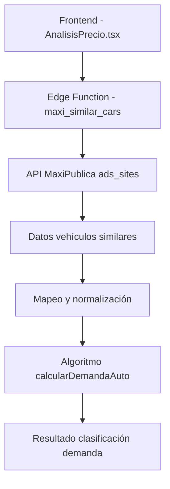

# Reporte Técnico: Sistema de Cálculo de Demanda Vehicular

**Fecha de elaboración:** 2025-09-30  
**Autor:** Sistema de Análisis Técnico  
**Versión:** 1.0  
**Alcance:** Componente de Cálculo de Demanda Vehicular

---

## 1. Resumen Ejecutivo

El sistema de cálculo de demanda vehicular utiliza una arquitectura basada en Edge Functions que consulta la API externa de MaxiPublica para obtener datos de mercado en tiempo real. El proceso calcula automáticamente el nivel de demanda de un vehículo específico basándose en la cantidad de anuncios similares disponibles y aplica factores de ajuste por marca y antigüedad.

---

## 2. Arquitectura del Sistema

### 2.1 Componentes Principales



### 2.2 Flujo de Datos Detallado

1. **Inicio del Proceso:**
   - Usuario ingresa datos del vehículo en formulario
   - Sistema obtiene `versionId` específico del vehículo

2. **Consulta a API Externa:**
   - Edge Function `maxi_similar_cars` recibe `versionId`
   - Se construye URL: `https://api.maxipublica.com/v3/ads_sites/210000?categoryId={versionId}&locationId=&transmission=TRANS-AUTOMATICA&kilometers=&origin=web`
   - Token de autenticación se obtiene automáticamente

3. **Procesamiento de Respuesta:**
   - API retorna conjunto de vehículos similares (ejemplo: 35 vehículos)
   - Datos se mapean al formato interno del sistema

4. **Cálculo de Demanda:**
   - Se ejecuta algoritmo `calcularDemandaAuto()`
   - Se aplican reglas de clasificación y factores de ajuste

---

## 3. Especificaciones Técnicas

### 3.1 Edge Function: maxi_similar_cars

**Archivo:** `supabase/functions/maxi_similar_cars/index.ts`

**Funcionalidad:**
- Consulta API MaxiPublica con versionId específico
- Utiliza token de autenticación almacenado en secrets
- Retorna datos normalizados de vehículos similares

**Parámetros de entrada:**
```typescript
{
  versionId: string  // ID específico de la versión del vehículo
}
```

**Respuesta típica:**
```typescript
{
  similarsCars: Array<{
    id: string,
    brand: string,
    model: string,
    year: number,
    trim: string,
    price: number,
    odometer: number,
    location: string,
    // ... otros campos
  }>
}
```

### 3.2 Algoritmo de Cálculo de Demanda

**Archivo:** `src/utils/priceAnalysisCalculations.ts`  
**Función:** `calcularDemandaAuto()`  
**Líneas:** 151-227

#### 3.2.1 Reglas de Clasificación Principal

```javascript
if (totalAnuncios > 15) {
  nivelDemanda = "Alta demanda";
} else if (totalAnuncios >= 5) {
  nivelDemanda = "Demanda moderada";
} else {
  nivelDemanda = "Baja demanda";
}
```

#### 3.2.2 Factores de Ajuste

**Por Marca:**
- **Marcas Alta Demanda (+1 punto):** Toyota, Honda, Mazda, Subaru
- **Marcas Demanda Media (0 puntos):** Nissan, Chevrolet, Ford, Volkswagen, Hyundai, Kia
- **Otras marcas (-1 punto):** Resto de marcas

**Por Antigüedad:**
- **≤ 2 años (+1 punto):** Vehículos muy nuevos
- **3-5 años (0 puntos):** Vehículos de edad media
- **> 5 años (-1 punto):** Vehículos antiguos

#### 3.2.3 Clasificación Especial

Para vehículos con puntuación máxima (marca premium + antigüedad baja):
```javascript
if (nivelDemanda === "Alta demanda" && ajustePorMarca === 1 && ajustePorAntiguedad === 1) {
  nivelDemanda = "Muy alta demanda";
}
```

---

## 4. Implementación Frontend

### 4.1 Componente Principal

**Archivo:** `src/components/AnalisisPrecio.tsx`

**Proceso de carga:**
1. Hook `useCallback` ejecuta `cargarAnalisis()`
2. Invoca Edge Function: `supabase.functions.invoke('maxi_similar_cars', { body: { versionId } })`
3. Mapea respuesta a formato interno
4. Aplica filtros adicionales (estado, tipo vendedor)
5. Calcula estadísticas y ejecuta `calcularDemandaAuto()`

### 4.2 Visualización de Resultados

**Archivo:** `src/components/AnalisisMercado.tsx`

**Datos mostrados:**
- Nivel de demanda con badge colorizado
- Cantidad de vehículos similares encontrados
- Información de debug técnico (modo debug activo)

---

## 5. Logs y Monitoreo

### 5.1 Logs de Edge Function

Según los registros del sistema:
```
timestamp: 1759206192797000
event_message: "API response received, total cars: 35"
event_type: "Log"
function_id: "0123203f-b8ec-4fa0-bfb8-1441625c9dc4"
```

### 5.2 Monitoreo de API Calls

```
Making API call to: https://api.maxipublica.com/v3/ads_sites/210000?categoryId=v_1_4_2_35_3&locationId=&transmission=TRANS-AUTOMATICA&kilometers=&origin=web
Using token (first 10 chars): 3e2a5b315e
```

---

## 6. Seguridad y Tokens

### 6.1 Gestión de Tokens

- Tokens se almacenan en Supabase Secrets
- Renovación automática mediante Edge Function `api_tokens`
- Encriptación de tokens en base de datos

### 6.2 Validación de Datos

- VersionId debe ser válido según catálogo MaxiPublica
- Validación de respuesta API antes de procesamiento
- Manejo de errores en caso de falla de API externa

---

## 7. Performance y Optimización

### 7.1 Tiempos de Respuesta

- Boot time Edge Function: ~28ms
- Respuesta API MaxiPublica: ~1.5s (típico)
- Procesamiento local: <100ms

### 7.2 Caching

- Sistema implementa `useMemo` para evitar recálculos
- Datos se mantienen en memoria durante sesión del usuario

---

## 8. Casos de Uso y Ejemplos

### 8.1 Caso Típico: Audi A3 2023

**Input:**
```javascript
versionId: "v_1_4_2_35_3"  // Audi A3 2023 4p 35 Dynamic L4/1.4/T Aut
```

**Proceso:**
1. API retorna 35 vehículos similares
2. Marca "Audi" recibe ajuste 0 (marca media)
3. Año 2023 (≤2 años) recibe ajuste +1
4. Total anuncios 35 > 15 = "Alta demanda"
5. Con ajuste por antigüedad: "Muy alta demanda"

### 8.2 Factores que Afectan el Resultado

- **Cantidad de anuncios:** Principal factor determinante
- **Marca del vehículo:** Marcas japonesas favorecidas
- **Antigüedad:** Vehículos nuevos reciben bonificación
- **Disponibilidad en API:** Dependiente de datos MaxiPublica

---

## 9. Mantenimiento y Evolución

### 9.1 Puntos de Monitoreo

1. **Disponibilidad API MaxiPublica:** Verificar respuestas exitosas
2. **Validez de tokens:** Monitorear renovación automática
3. **Calidad de datos:** Verificar coherencia en resultados

### 9.2 Posibles Mejoras

1. **Cache distribuido:** Implementar Redis para datos frecuentes
2. **ML predictivo:** Incorporar machine learning para demanda
3. **Regionalización:** Ajustes específicos por estado/ciudad
4. **Tiempo real:** WebSockets para actualizaciones dinámicas

---

## 10. Conclusiones

El sistema de cálculo de demanda vehicular presenta una arquitectura robusta que combina datos externos en tiempo real con algoritmos de clasificación locales. La implementación mediante Edge Functions garantiza escalabilidad y performance, mientras que los factores de ajuste por marca y antigüedad proporcionan precisión específica para el mercado mexicano.

**Fortalezas:**
- Datos actualizados en tiempo real
- Algoritmo adaptado al mercado local
- Arquitectura escalable y mantenible

**Áreas de oportunidad:**
- Dependencia de API externa única
- Algoritmo estático sin aprendizaje adaptativo
- Limitaciones en regionalización específica

---

**Fin del Reporte**